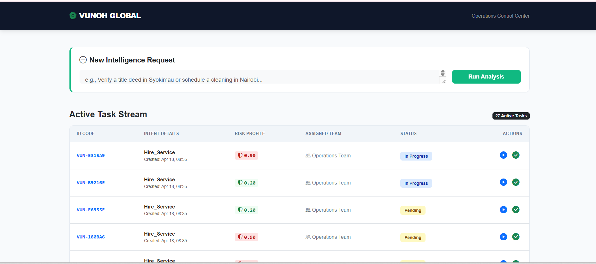
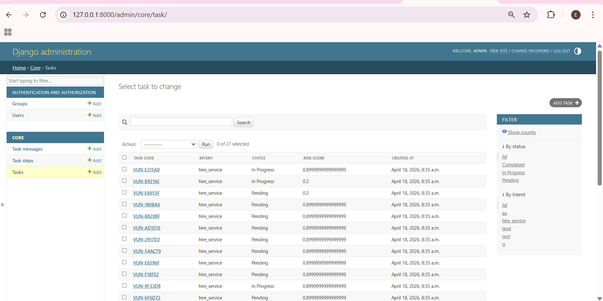

# Vunoh Global AI-Powered Web Application - Diaspora Service (Ref: #279)

An AI-powered web application designed to help Kenyans living abroad manage essential tasks back home through a structured, reliable, and auditable platform.

## 📌 Project Overview
Kenyans in the diaspora often rely on informal, slow, and unreliable channels (like WhatsApp or word-of-mouth) to manage affairs in Kenya. This project replaces those fragmented methods with an intelligent assistant that:
- **Extracts User Intent:** Automatically identifies the service required from plain English.
- **Assesses Risk:** Calculates a risk score based on real-world Kenyan contexts.
- **Automates Communication:** Generates tailored messages for WhatsApp, Email, and SMS.
- **Tracks Progress:** Provides a dashboard to manage tasks from initiation to completion.

  ## Dashboard
  
  ### 🖥️ Operations Control Center
The **Control Center** is the heart of the platform, transforming informal diaspora requests into structured, auditable tasks.

* **Intelligence Intake** 🧠: Users submit requests in plain English. The "Run Analysis" feature uses **Gemini 1.5 Flash** to instantly extract intent and entities.
* **Live Audit Trail** 🌊: A real-time stream tracking unique Task IDs (e.g., `VUN-E315A9`), categories, and timestamps.
* **Contextual Risk Scoring** 🛡️: Displays a visual risk profile from **0.20 (Low)** to **0.90 (High)** based on Kenyan-specific factors like land fraud or high-value transfers.
* **Automated Routing**: Intelligently assigns tasks to specialized departments (e.g., **Operations**, **Legal**, or **Finance**).
* **Reactive State Management** 🔄: Uses **Vanilla JS** and the **Fetch API** to update task statuses (Pending ➡️ In Progress  Completed) instantly without page reloads.
  
* ### 🛠️ Backend Administration (Django Admin)
  

The system leverages the **Django Admin** interface to provide staff with a powerful "backstage" view of all operations.
* **Centralized Oversight**: A single source of truth where admins can monitor all `Task`, `Step`, and `Message` objects.
* **Data Integrity Verification**: Directly view AI-extracted entities and decimal-accurate **Risk Scores** to ensure processing accuracy.
* **Advanced Filtering** 🔍: Sidebar tools allow staff to segment the workload by status (e.g., *Pending* vs. *In Progress*) or service type (e.g., *Land Verification*).
* **Audit Readiness**: Every record includes a `Created At` timestamp, fulfilling the requirement for a verifiable history of diaspora requests.
  

## 🛠 Tech Stack
- **Backend:** **Django (Python)** - Chosen for its robust ORM, security features, and alignment with Vunoh’s internal stack.
- **Frontend:** **HTML5 & CSS3** - A framework-free, clean UI designed for professional clarity and rapid performance.
- **Interactivity:** **Vanilla JavaScript** - Handles asynchronous API calls (Fetch API) and real-time dashboard updates.
- **Database:** **PostgreSQL** - Ensuring full persistence of tasks, AI-extracted entities, and communication logs.
- **AI Integration:** **Gemini 1.5 Flash** - Leveraged for structured JSON extraction, risk reasoning, and natural language generation.

## ⚖️ Risk Scoring Philosophy
To ensure safety and reliability, the system evaluates every request using a weighted scoring model grounded in the Kenyan context:
1. **Financial Velocity:** Transactions exceeding **KES 50,000** combined with "Urgent" status trigger higher risk alerts (+25).
2. **Real Estate Integrity:** Document verification, particularly **Land Titles**, is weighted heavily (+30) due to complexity and fraud risks in the local property market.
3. **Audit Trail:** By moving requests from informal messages to a structured database, we create a verifiable history for both the customer and the operations team.

## 📝 Decisions I Made and Why
### **AI Tools Used**
I used **Cursor** and **ChatGPT** to assist in scaffolding the Django models and designing the custom CSS layouts. The **Gemini API** was integrated as the live inference engine to handle the application's intelligent logic.

### **System Prompt Design**
I designed the system prompt to enforce **Strict JSON output**. 
- **Inclusion:** I used few-shot prompting to ensure the AI identifies entities like `amount`, `recipient`, and `location` accurately.
- **Reasoning:** Reliability is critical; if the AI returns free-form text instead of JSON, the backend cannot automate the task creation or database entry.

### **Overriding the AI**
- **The Decision:** The AI initially suggested assigning "Document Verification" to the general Operations team.
- **The Override:** I manually forced the system to route these tasks to the **Legal Team**.
- **Reasoning:** In Kenya, verifying land titles or certificates requires specialized legal knowledge to navigate government registries effectively.

### **Challenges & Resolutions (HTML/CSS & Vanilla JS)**
- **Problem:** Updating task statuses (Pending -> In Progress -> Completed) on the dashboard without a full page reload or a frontend framework like React.
- **Resolution:** I utilized the **JavaScript Fetch API** to send requests to Django endpoints. Upon a successful **PostgreSQL** update, I manipulated the **DOM** directly using Vanilla JS to update the UI. This ensured a modern, reactive feel using only fundamental web technologies.

## 📂 Project Structure
```text
vunoh-ai-internship-279/
│
├── manage.py
├── requirements.txt
├── README.md
├── .gitignore
├── .env.example
|
├── vunoh_backend/                     # Django project configuration
│   ├── __init__.py
│   ├── settings.py
│   ├── urls.py
│   ├── asgi.py
│   └── wsgi.py
│
├── apps/                              # All Django applications
│   │
│   ├── core/                          # Main business app
│   │   ├── migrations/
│   │   │   └── __init__.py
│   │   ├── templates/core/
│   │   ├── __init__.py
│   │   ├── admin.py
│   │   ├── apps.py
│   │   ├── models.py
│   │   ├── views.py
│   │   ├── urls.py
│   │   └── tests.py
│   │
│   ├── api/                           # REST API layer
│   │   ├── __init__.py
│   │   ├── views.py
│   │   ├── serializers.py
│   │   ├── urls.py
│   │   └── tests.py
│
├── media/                             # Uploaded files
│
├── docs/                              # Documentation 
|    ├── architecture.md
|    ├── sql

